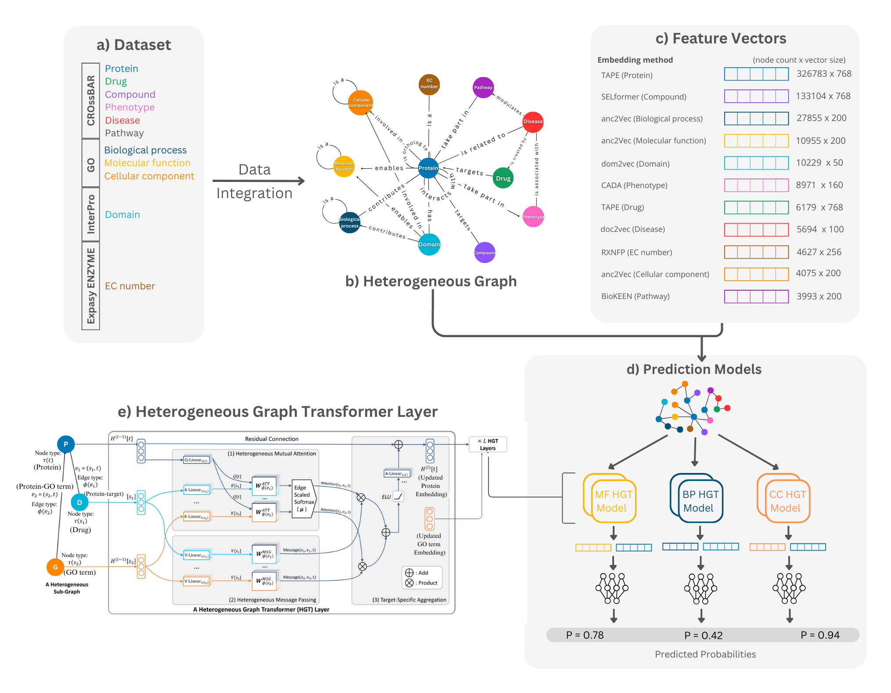

# ProtHGT: Automated Protein Function Prediction Using Heterogeneous Graph Transformers
[](https://huggingface.co/spaces/HUBioDataLab/ProtHGT) [](http://www.gnu.org/licenses/)


The rapid accumulation of protein sequence data, coupled with the slow pace of experimental annotations, creates a critical need for computational methods to predict protein functions. Existing models often rely on limited data types, such as sequence-based features or protein-protein interactions (PPIs), failing to capture the complex molecular relationships in biological systems. To address this, we developed ProtHGT, a heterogeneous graph transformer-based model that integrates diverse biological datasets into a unified framework using knowledge graphs for accurate and interpretable protein function prediction.
ProtHGT achieves state-of-the-art performance on benchmark datasets, demonstrating its ability to outperform current graph-based and sequence-based approaches. By leveraging diverse biological entity types and highly representative protein language model embeddings at the input level, the model effectively learns complex biological relationships, enabling accurate predictions across all Gene Ontology (GO) sub-ontologies. Ablation analyses highlight the critical role of heterogeneous data integration in achieving robust predictions. Finally, our use-case study has indicated that it’s possible to interpret ProtHGT’s predictions via exploring the related parts of our input biological knowledge graph, offering plausible explanations to build or test new hypotheses.

|  | 
|:--:| 
| **Schematic representation of the ProtHGT framework.** **a)** Diverse biological datasets, including proteins, pathways, domains, and GO terms, are integrated into a unified knowledge graph; **b)** the heterogeneous graph is constructed, capturing multi-relational biological associations; **c)** feature vectors for each node type are generated using state-of-the-art embedding methods; **d)** protein function prediction models are trained separately for molecular function, biological process, and cellular component sub-ontologies; **e)** heterogeneous graph transformer (HGT) layers process and refine node representations through multi-relational message passing. Final protein function predictions are obtained by linking proteins to GO terms based on learned embeddings and attention-weighted relationships. |

## Content <!-- omit in toc -->

## The Architecture of ProtHGT

ProtHGT builds upon the **Heterogeneous Graph Transformer (HGT)** architecture, consisting of multiple stacked transformer layers to refine node embeddings while preserving node-type and edge-type diversity. 

### 1. Input Feature Transformation  
Each node type (e.g., Protein, GO Term) is projected into a shared hidden space using independent linear transformations:
```python
self.lin_dict = torch.nn.ModuleDict({
    node_type: Linear(data.x_dict[node_type].size(-1), hidden_channels)
    for node_type in data.node_types
})
```
This ensures that different biological entities have their own representation before message passing.

### 2. Heterogeneous Graph Transformer Layers

ProtHGT applies multiple HGT layers (``HGTConv`` implementation from PyTorch Geometric) to propagate information across node types using multi-head attention:

```python
self.convs = torch.nn.ModuleList()
for _ in range(num_layers):
    conv = HGTConv(hidden_channels, hidden_channels, data.metadata(), num_heads, group='sum')
    self.convs.append(conv)
```

### 3. Protein Function Prediction (Link Prediction)

ProtHGT models protein function prediction as a link prediction task between Protein and GO Term nodes.
The final embeddings of the two nodes are concatenated and passed through an MLP for classification:

```python
row, col = tr_edge_label_index
z = torch.cat([x_dict["Protein"][row], x_dict[target_type][col]], dim=-1)
return self.mlp(z).view(-1), x_dict
```
The MLP predicts the probability of a functional association between a protein and a GO term.


## Repository Structure
- **data/**: Contains the knowledge graph data required for training and evaluating ProtHGT.  
Data files can be downloaded from [Google Drive](https://drive.google.com/drive/u/0/folders/1VcMcayVnBD82F7xcUzLFNzlEixRSoFSu) and must be placed in this directory for `train.py` and `predict.py` to function properly.
- **models/**: Stores trained models for each GO category
- **configs/**: Configuration files for optimized model parameters and training settings
- **src/**: Main source code directory
  - `model.py`: Implementation of the ProtHGT architecture
  - `train.py`: Script for training the model
  - `predict.py`: Script for generating predictions
  - `utils.py`: Helper functions and utilities
  - `data_loader.py`: Helper functions for data loading and preprocessing
- **requirements.txt**: Lists all Python package dependencies

## Getting Started
We highly recommend you to use conda platform for installing dependencies properly. After installation of appropriate conda version for your operating system, create and activate conda environment with dependencies as below:

```sh
conda create -n prothgt
conda activate prothgt
```

Then, install the dependencies using the `requirements.txt` file:

```sh
pip install -r requirements.txt
```

## Training the ProtHGT Model
For training the ProtHGT model, run the `train.py` script with the following example command:

```sh
python train.py --train-data ../data/prothgt-train-graph.pt --val-data ../data/prothgt-val-graph.pt --test-data ../data/prothgt-test-graph.pt --target-type GO_term_F --config ../configs/config.json
```

**Arguments:**
- `--train-data`: Path to the training data file
- `--val-data`: Path to the validation data file
- `--test-data`: Path to the test data file
- `--target-type`: Target prediction type. It can be one of the following: `GO_term_F` for molecular function, `GO_term_P` for biological process, and `GO_term_C` for cellular component.
- `--config`: Path to the configuration file. You can use your own or select from the optimized hyperparameter configurations in `configs/` directory.
- `--output-dir`: Path to the output directory. Default is `../outputs`.
- `--checkpoint-dir`: Path to the checkpoint directory. Default is None.
- `--num-workers`: Number of workers for data loading. Default is 2.

Before running the training script, make sure that the data files are correctly placed in the `data/` directory.

## Making Predictions

To generate function predictions for a given protein list using ProtHGT, you can either use our web-service here: [ProtHGT Web-Service](https://huggingface.co/spaces/HUBioDataLab/ProtHGT) or run the `predict.py` script with the following example command. This script uses our trained ProtHGT models provided in `models/` directory to make predictions.

```sh
python predict.py --protein_ids ..data/example_protein_ids.txt --heterodata_path ../data/prothgt-kg.pt --go_category all
```

**Arguments:**
- `--protein_ids`: You can either provide a text file containing a list of protein IDs or a comma-separated string of protein IDs.
- `--heterodata_path`: Path to the knowledge graph data file.
- `--go_category`: GO category to predict. It can be one of the following: `all`, `molecular_function`, `biological_process`, or `cellular_component`.
- `--output_dir`: Path to the output directory. Default is `../predictions`.
- `--batch_size`: Number of proteins to process in each batch. Default is 100.

The output file is a csv file containing the following columns:
- `Protein`: UniProt ID
- `GO_term`: GO term ID
- `GO_category`: GO term category. Either `Molecular Function`, `Biological Process`, or `Cellular Component`.
- `Probability`: Probability of the prediction.

**Note:** Currently, ProtHGT can only generate predictions for proteins that exist in our knowledge graph, which includes over 300,000 UniProtKB/Swiss-Prot proteins. To enable predictions for novel proteins from their sequences, we are developing a real-time data retrieval system that dynamically fetches relational data from external sources (e.g., STRING, Reactome) and constructs a customized knowledge graph for inference. This system will allow ProtHGT to predict functions for previously unseen proteins by integrating newly acquired biological relationships.

## License
Copyright (C) 2025 HUBioDataLab

This program is free software: you can redistribute it and/or modify it under the terms of the GNU General Public License as published by the Free Software Foundation, either version 3 of the License, or (at your option) any later version.

This program is distributed in the hope that it will be useful, but WITHOUT ANY WARRANTY; without even the implied warranty of MERCHANTABILITY or FITNESS FOR A PARTICULAR PURPOSE. See the GNU General Public License for more details.

You should have received a copy of the GNU General Public License along with this program. If not, see http://www.gnu.org/licenses/.
